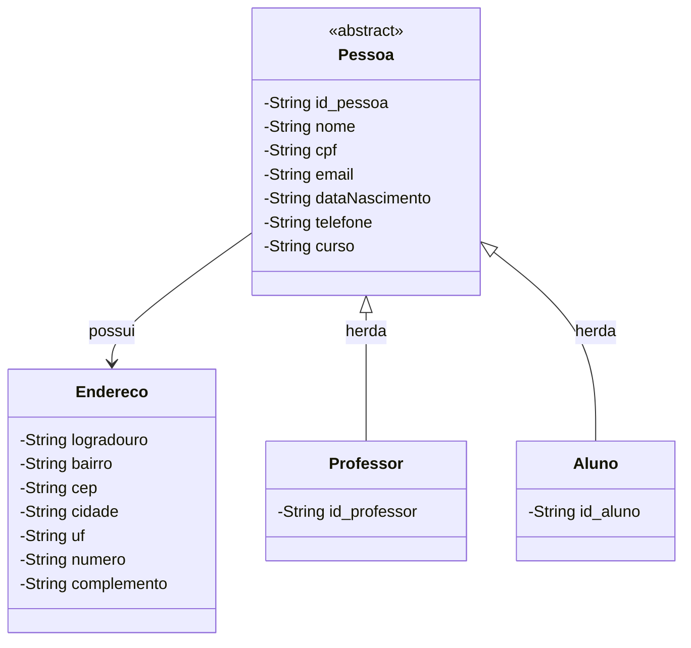

# api_escola

```mermaid
classDiagram
    class Pessoa {
        <<abstract>>
        -String id_pessoa
        -String nome
        -String cpf
        -String email
        -String dataNascimento
        -String telefone
        -String curso
    }

    class Endereco {
        -String logradouro
        -String bairro
        -String cep
        -String cidade
        -String uf
        -String numero
        -String complemento
    }

    class Professor {
        -String id_professor
    }

    class Aluno {
        -String id_aluno
    }

    Pessoa --> Endereco : possui
    Pessoa <|-- Professor : herda
    Pessoa <|-- Aluno : herda

```
