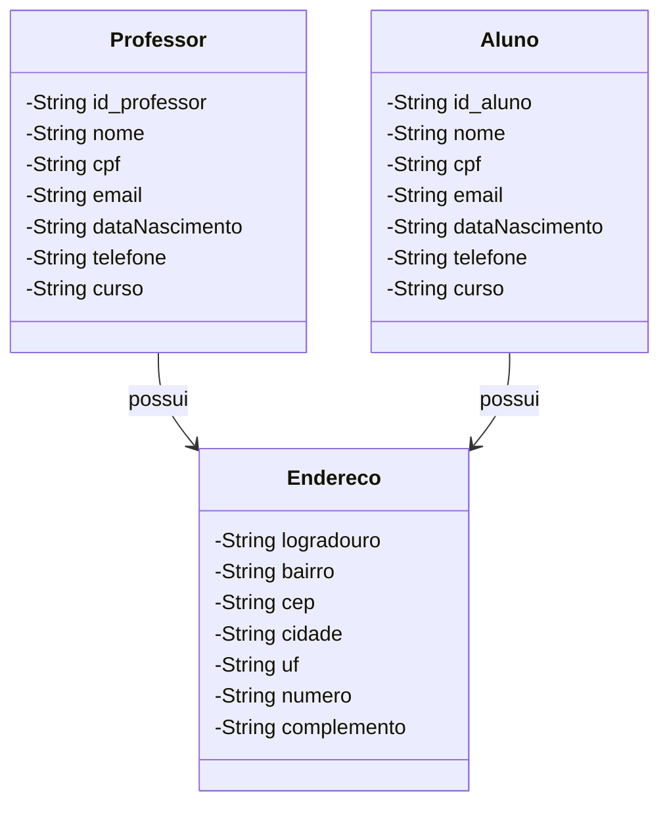

# 🏫 Sistema de Gestão Escolar

Este projeto é um sistema simples de gestão de uma escola, onde é possível cadastrar alunos e professores, armazenando suas informações pessoais e de endereço. O sistema foi desenvolvido em **Java** com **Spring Boot**, utilizando uma arquitetura MVC com suporte a **DTOs** para comunicação entre as camadas. O banco de dados é gerido por **H2** e a interface web é renderizada com **Thymeleaf**.

## 🎯 Funcionalidades

- Cadastro de alunos e professores.
- Listagem de todos os registros de alunos e professores.
- Atualização e remoção de registros.
- Validação e mapeamento de dados utilizando **DTOs**.
- Persistência dos dados em banco de dados em memória (**H2**).

## 📋 Diagrama de Classes

A modelagem das classes do projeto segue a estrutura abaixo, com uma relação de herança entre **Aluno**, **Professor** e a classe abstrata **Pessoa**, além da relação de composição com a classe **Endereco**:



## 🚀 Tecnologias Utilizadas

As principais tecnologias utilizadas no desenvolvimento deste projeto são:

- **Java 17**: Linguagem principal do projeto.
- **Spring Boot 3.x**: Framework para construção do backend com injeção de dependências e suporte a REST APIs.
- **Spring Web**: Para criação de endpoints e integração com o padrão MVC.
- **JPA (Java Persistence API)**: Para mapeamento objeto-relacional (ORM) e manipulação dos dados.
- **H2 Database**: Banco de dados em memória utilizado para persistência dos dados.
- **Lombok**: Biblioteca para reduzir código boilerplate (getters, setters, construtores).
- **Thymeleaf**: Template engine utilizada para renderização de páginas web.
- **DTO (Data Transfer Object)**: Padrão utilizado para transferir dados entre camadas.
- **Spring DevTools**: Ferramentas para facilitar o desenvolvimento, incluindo auto-restart.
- **Maven**: Gerenciamento de dependências e build.
- **Visual Studio Code**: Editor de código utilizado no desenvolvimento.

## 📦 Instalação e Configuração

### 1. Pré-requisitos

Certifique-se de ter instalado os seguintes componentes:

- **Java 17** ou superior.
- **Maven** para gerenciamento de dependências.
- **Git** para controle de versão.

### 2. Clonando o Repositório

Clone o projeto localmente:

```bash
git clone https://github.com/seu-usuario/sistema-escolar.git
```

### 3. Rodando o Projeto

Navegue até o diretório do projeto e execute o seguinte comando para rodar a aplicação:

```bash
cd sistema-escolar
mvn spring-boot:run
```

O sistema estará disponível em `http://localhost:8080`.

### 4. Acesso ao Banco de Dados H2

Acesse o console do banco de dados H2 em:

```
http://localhost:8080/h2-console
```

As credenciais para o H2 estão definidas no arquivo `application.properties`:

```properties
spring.h2.console.enabled=true
spring.datasource.url=jdbc:h2:mem:escoladb
spring.datasource.driverClassName=org.h2.Driver
spring.datasource.username=sa
spring.datasource.password=password
```

## 🗂️ Estrutura do Projeto

- **Controller**: Camada responsável por gerenciar as requisições HTTP e mapeá-las para os serviços.
- **Service**: Camada de lógica de negócios.
- **Repository**: Camada de acesso aos dados, utilizando **JPA**.
- **Model**: Representação das entidades (Pessoa, Aluno, Professor, Endereco).
- **DTO**: Objetos utilizados para transferir dados entre as camadas.
- **Thymeleaf**: Arquivos de templates HTML para renderização das views.

## 🤝 Contribuições

Contribuições são bem-vindas! Sinta-se à vontade para abrir *issues* e *pull requests*.

## 📄 Licença

Este projeto está licenciado sob a [MIT License](LICENSE).
